# 🏗️ Sistema de Gestión de Materiales de Construcción (SDG_MDC)

<div align="center">
  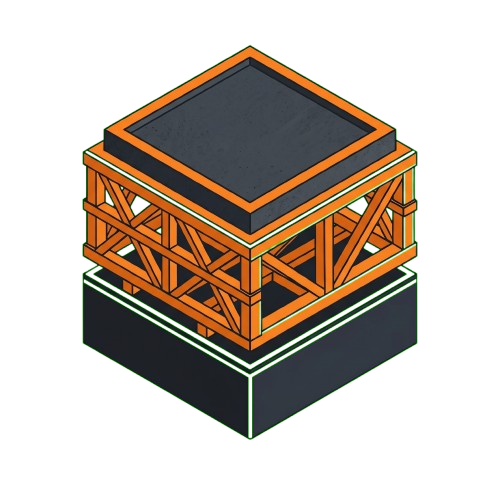
</div>

<br>

<div align="center">

<div align="center">

[](https://www.oracle.com/java/technologies/javase/jdk17-archive-downloads.html)
[](https://openjfx.io/)
[](https://maven.apache.org/)
[](https://developer.mozilla.org/es/docs/Glossary/MVC)
[](https://es.wikipedia.org/wiki/Valores_separados_por_comas)

</div>
</div>

---

## 📑 Tabla de Contenidos
- [Acerca del Proyecto](#acerca-del-proyecto)
- [Documentación de Diagramas UML](#documentación-de-diagramas-uml)
- [Vistas Previas del Sistema](#vistas-previas-del-sistema)
- [Stack Tecnológico](#stack-tecnológico)
- [Requerimientos Funcionales](#requerimientos-funcionales-rf)
- [Requerimientos No Funcionales](#requerimientos-no-funcionales-rnf)
- [Instalación y Ejecución](#instalación-y-ejecución)

---

## 📖 Acerca del Proyecto

Este proyecto consiste en una solución de software diseñada para optimizar las operaciones diarias de una tienda de materiales de construcción y su manejo de materiales. El sistema permite gestionar desde el catálogo de productos y el inventario hasta la generación de reportes financieros, garantizando precisión y eficiencia en la toma de decisiones comerciales mediante accesos controlados por roles (Gerente, Vendedor, Almacenista).

---

## 📊 Documentación de Diagramas UML

Esta sección documenta la arquitectura y el comportamiento del **SDG_MDC**, modelado mediante diagramas UML (generados con Astah). Se garantiza la coherencia entre los requerimientos, el diseño visual y la implementación en el código fuente.

<details>
  <summary><b>1. Diagrama de Casos de Uso</b> <i>[Clic para expandir]</i></summary>
  <br>
  <div align="center">
    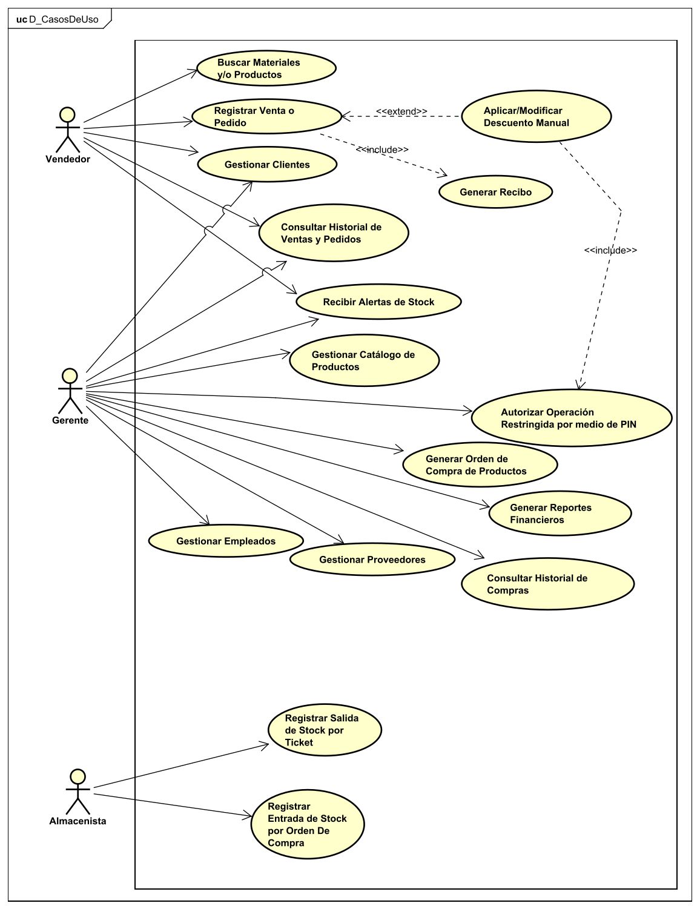
    <p><i>Ilustra las interacciones actuales de los tres actores principales (Gerente, Vendedor, Almacenista) con los módulos del sistema, definiendo los límites de acceso y operaciones permitidas.</i></p>
  </div>
</details>

<details>
  <summary><b>2. Diagrama de Clases (Diseño y Patrones)</b> <i>[Clic para expandir]</i></summary>
  <br>
  <div align="center">
    
    <p><i>Estructura estática del sistema bajo la arquitectura MVC. <b>Nota:</b> En este diagrama se refleja la aplicación de los principios SOLID y la implementación de los tres patrones de diseño seleccionados para resolver problemas específicos de creación, estructura o comportamiento.</i></p>
  </div>
</details>

<details>
  <summary><b>3. Diagrama de Secuencia</b> <i>[Clic para expandir]</i></summary>
  <br>
  <div align="center">
    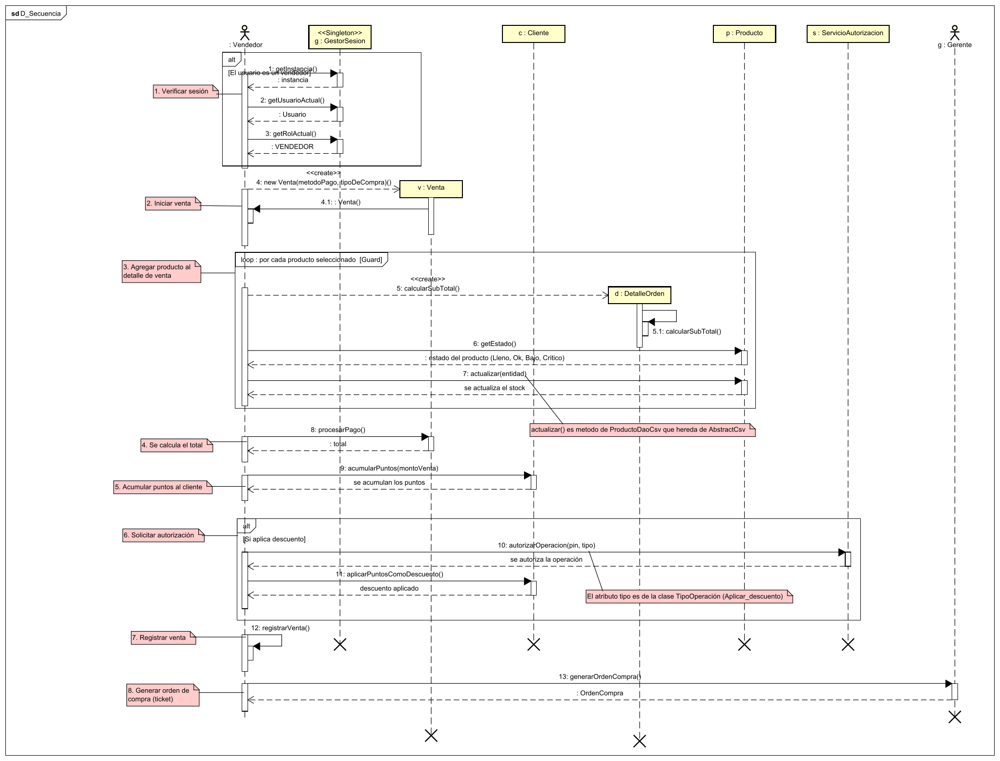
    <p><i>Detalla el flujo de mensajes en el tiempo para un proceso de realización de venta.</i></p>
  </div>
</details>
    

<details>
  <summary><b>4. Diagrama de Estado</b> <i>[Clic para expandir]</i></summary>
  <br>
  <div align="center">
    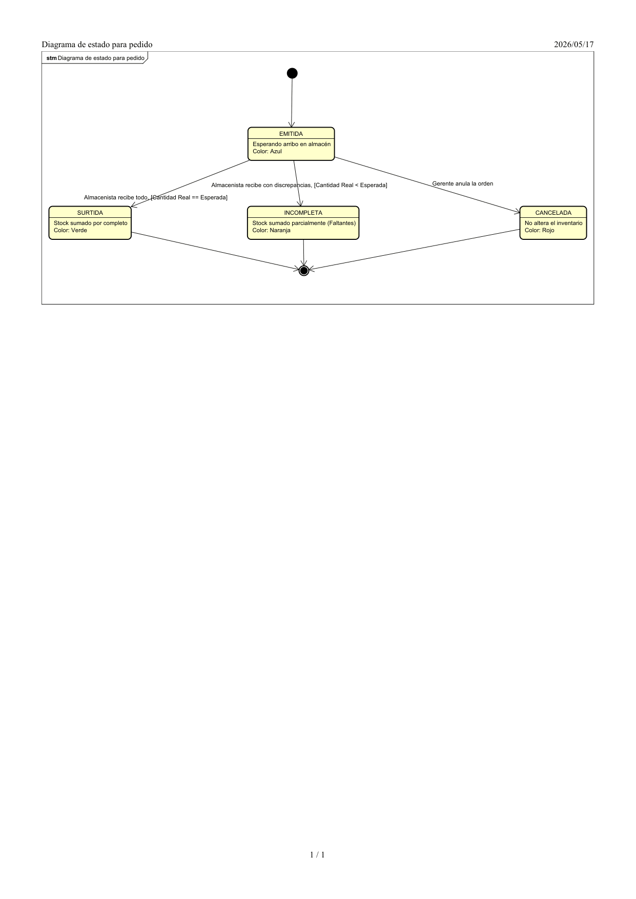
    <p><i>Muestra las transiciones por las que pasa un objeto complejo durante su ciclo de vida dentro de la aplicación (ej. el ciclo de vida de una Orden de Compra: Pendiente -> Recibida -> Discrepancia/Completada).</i></p>
  </div>
</details>

<details>
  <summary><b>5. Diagrama de Colaboración (Comunicación)</b> <i>[Clic para expandir]</i></summary>
  <br>
  <div align="center">
    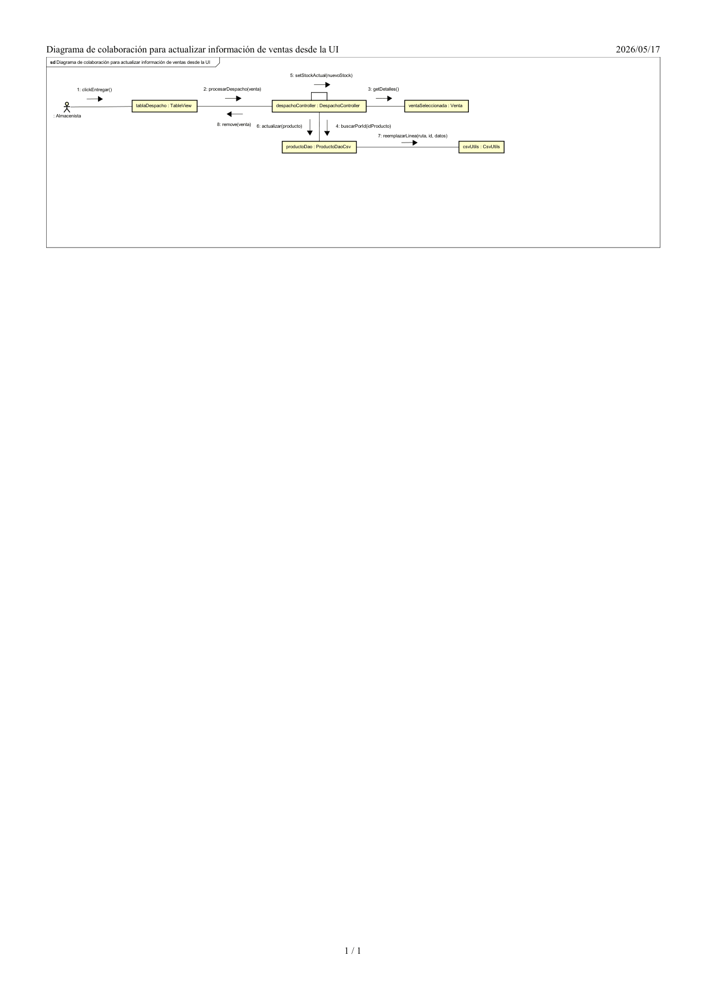
    <p><i>Enfatiza la organización estructural de los objetos que envían y reciben mensajes, complementando la vista del diagrama de secuencia.</i></p>
  </div>
</details>

<details>
  <summary><b>6. Diagrama de Actividad</b> <i>[Clic para expandir]</i></summary>
  <br>
  <div align="center">
    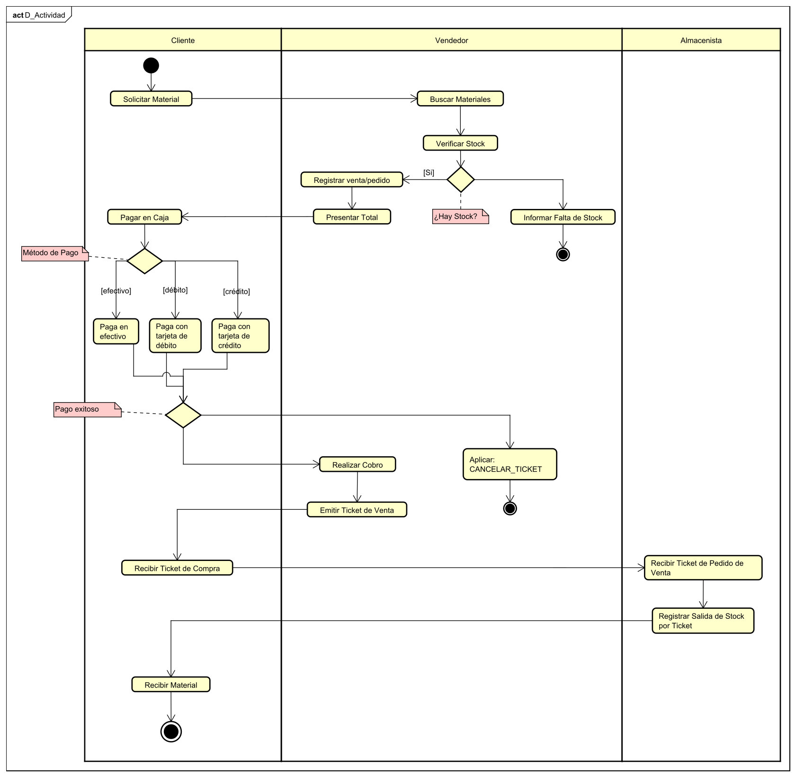
    <p><i>describe el proceso de venta de materiales, mostrando la interacción entre cliente, vendedor y almacenista.</i></p>
  </div>
</details>

---

## 📸 Vistas Previas del Sistema

> **Nota:** El sistema cuenta con interfaces adaptativas según el rol del usuario, garantizando que cada colaborador acceda únicamente a las herramientas necesarias para su función.

---

### 🔑 Módulo de Acceso (Login)
<details>
  <summary><b>Pantallas de Autenticación</b> <i>[Clic para expandir]</i></summary>
  <br>
  <div align="center">
    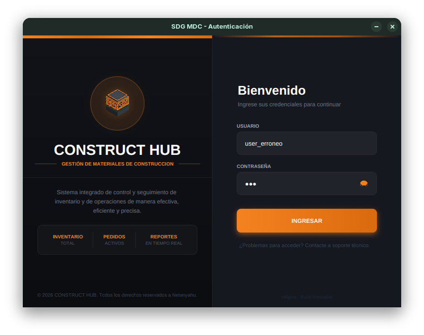
    <p><i>Interfaz principal de acceso. Implementa validación de campos para prevenir entradas nulas o formatos incorrectos.</i></p>
    <br>
    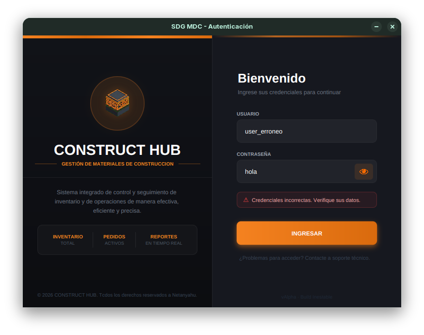
    <p><i>Visualización del estado activo de los campos de texto con respuesta visual inmediata para el usuario. Igualmente se puede observar que el campo de contraseña puede ser visible u oculto.</i></p>
  </div>
Nota: Dependiendo de las credenciales ingresadas, el usuario será llevado a su panel correspondiente (Gerente, Vendedor o Almacenista) según su rol asignado.
</details>

---

### 👔 Módulo Administrativo (Gerente)
Esta sección centraliza las herramientas de inteligencia de negocio y gestión de recursos humanos y materiales.

<details>
  <summary><b>1. Panel de Control (Dashboard)</b></summary>
  <br>
  <div align="center">
    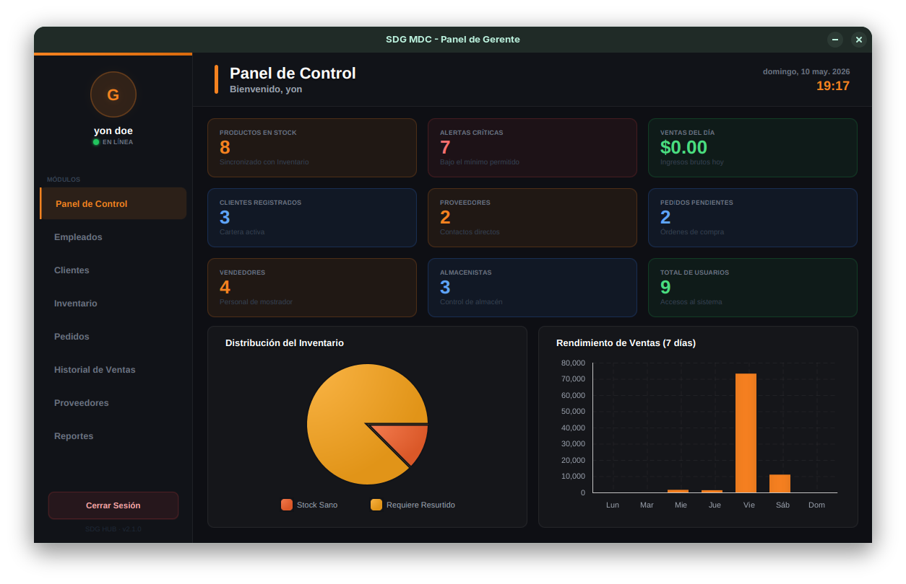
    <p><i>Visualización de métricas clave, KPIs de ventas y estado del inventario en tiempo real.</i></p>
  </div>
</details>

<details>
  <summary><b>2. Gestión de Empleados</b></summary>
  <br>
  <div align="center">
    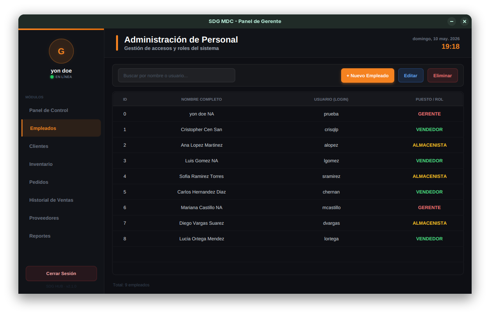
    <p><i>Administración de la plantilla laboral, permitiendo el control de roles y credenciales de acceso.</i></p>
  </div>
</details>

<details>
  <summary><b>3. Gestión de Clientes</b></summary>
  <br>
  <div align="center">
    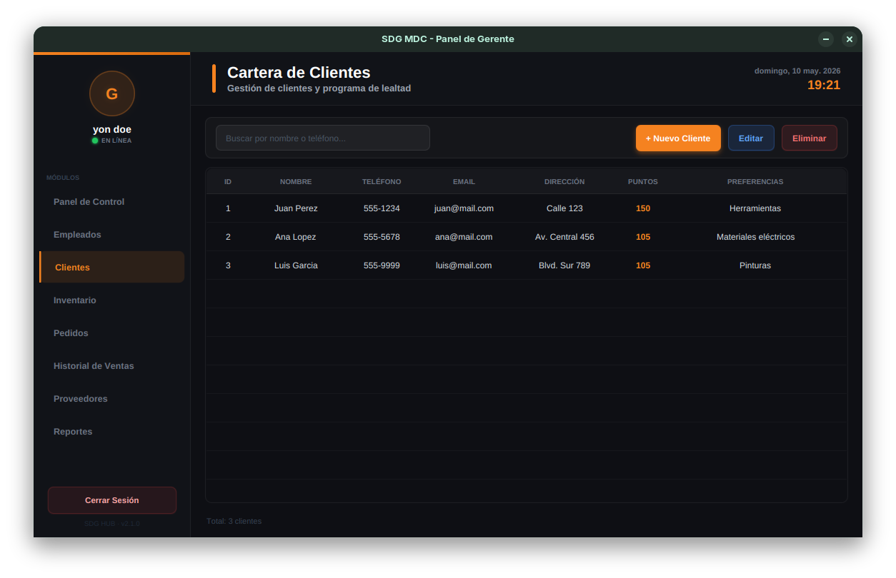
    <p><i>Directorio de clientes frecuentes con historial de puntos acumulados para el programa de lealtad.</i></p>
  </div>
</details>

<details>
  <summary><b>4. Control de Inventario</b></summary>
  <br>
  <div align="center">
    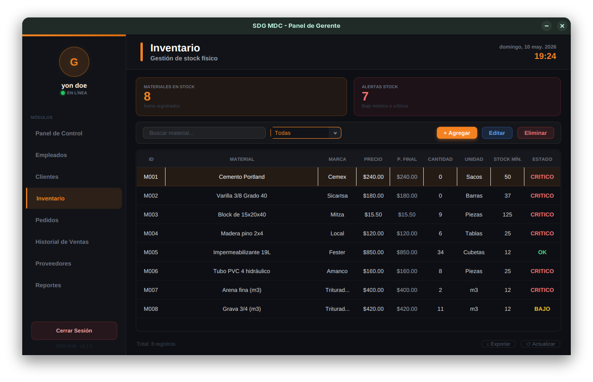
    <p><i>Catálogo maestro de materiales de construcción con alertas de stock mínimo preestablecidas.</i></p>
  </div>
</details>

<details>
  <summary><b>5. Gestión de Pedidos</b></summary>
  <br>
  <div align="center">
    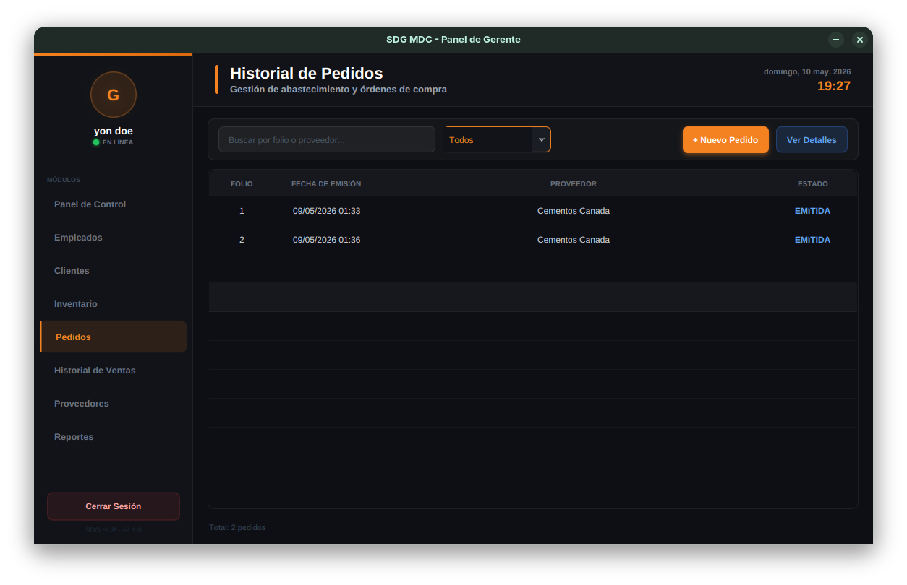
    <p><i>Seguimiento de pedidos internos y solicitudes de materiales para las operaciones.</i></p>
  </div>
</details>

<details>
  <summary><b>6. Historial de Ventas</b></summary>
  <br>
  <div align="center">
    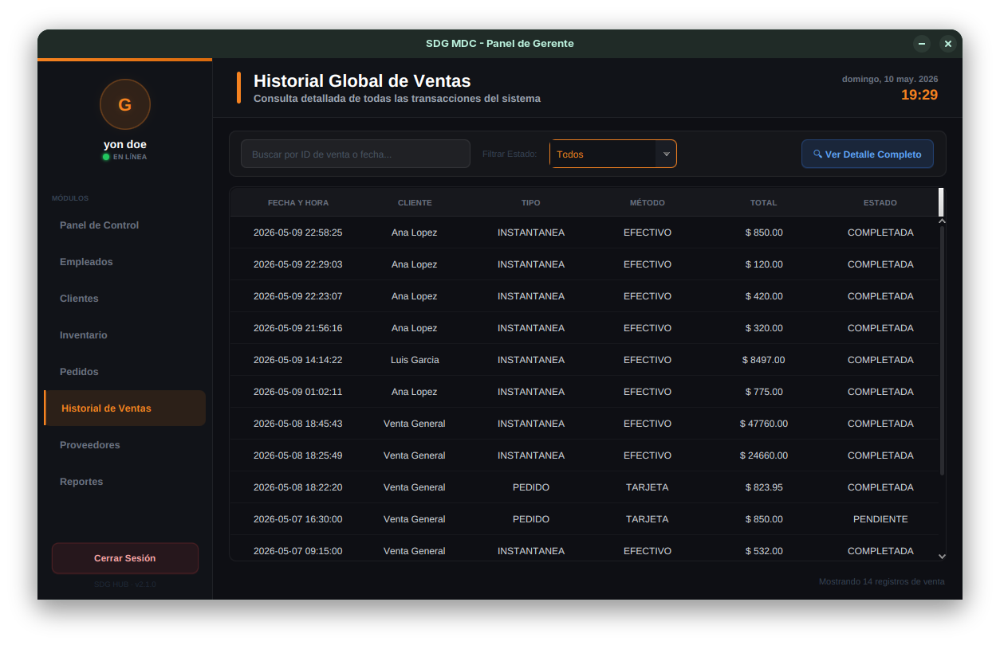
    <p><i>Registro inmutable de transacciones económicas, facilitando la transparencia financiera.</i></p>
  </div>
</details>

<details>
  <summary><b>7. Directorio de Proveedores</b></summary>
  <br>
  <div align="center">
    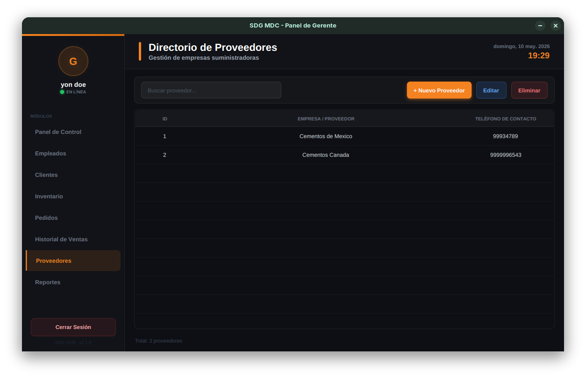
    <p><i>Administración de contactos y catálogos de proveedores para el reabastecimiento de stock.</i></p>
  </div>
</details>

<details>
  <summary><b>8. Reportes e Inteligencia</b></summary>
  <br>
  <div align="center">
    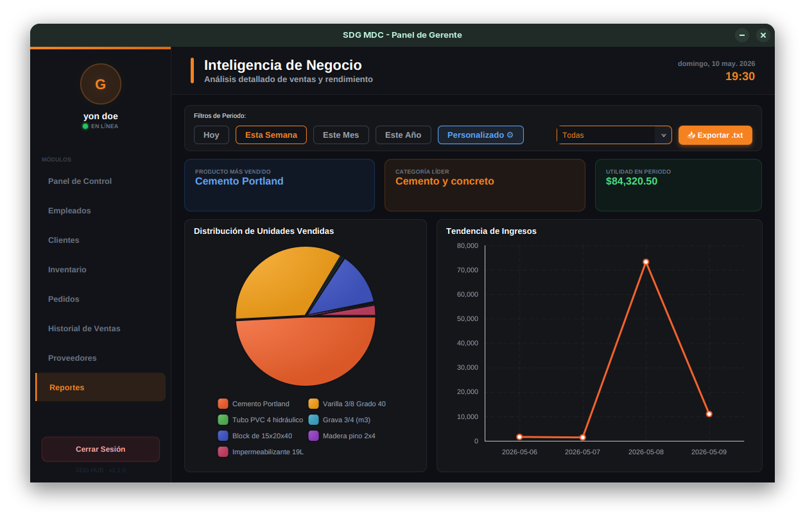
    <p><i>Generación de informes detallados en formato plano para el análisis de rendimiento mensual y anual.</i></p>
  </div>
</details>

---

### 🛒 Módulo Operativo (Vendedor)
<details>
  <summary><b>Punto de Venta (POS)</b> <i>[Clic para expandir]</i></summary>
  <br>
  <div align="center">
    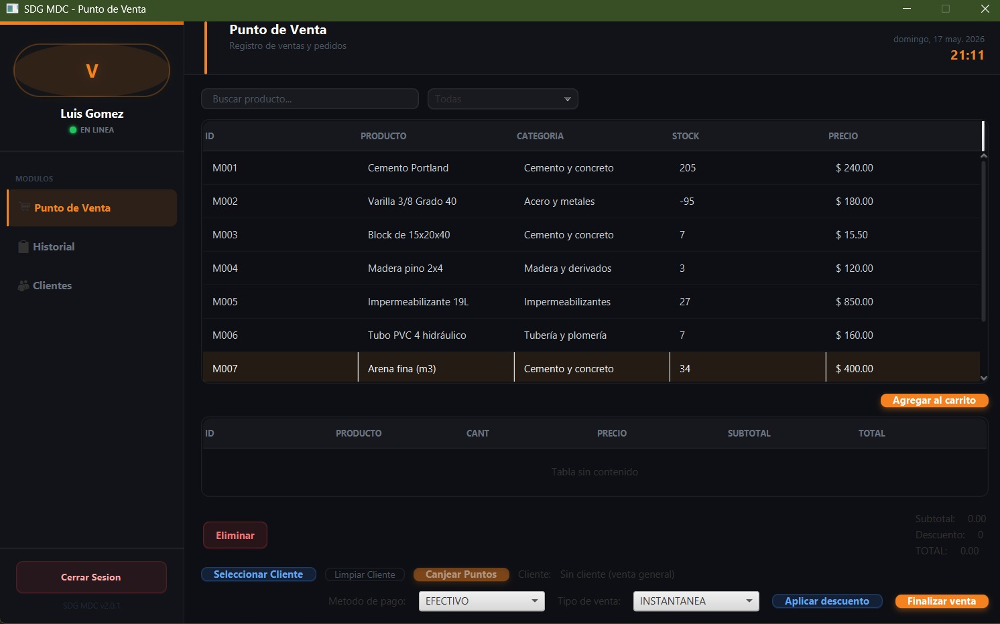
    <p><i>gestionar el proceso completo de una venta, desde la selección de productos hasta la generación del recibo.</i></p>
  </div>
</details>

<details>
  <summary><b>Historial (POS)</b> <i>[Clic para expandir]</i></summary>
  <br>
  <div align="center">
    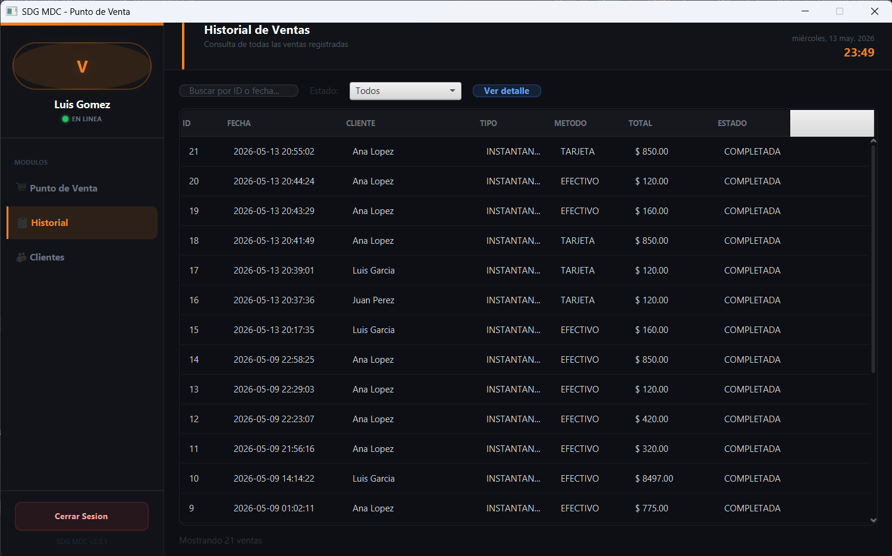
    <p><i>Permite buscar y visualizar el historial de ventas de un cliente específico (por ID), mostrando detalles como fecha, tipo de recibo, método de pago, costo y estado.</i></p>
  </div>
</details>

<details>
  <summary><b>Clientes (POS)</b> <i>[Clic para expandir]</i></summary>
  <br>
  <div align="center">
    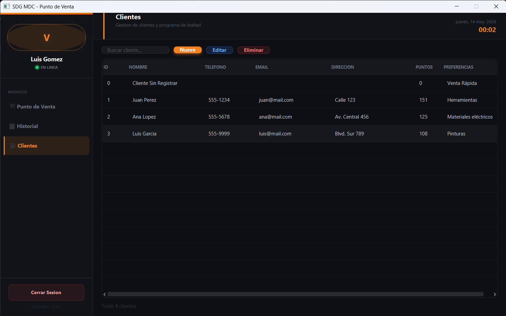
    <p><i>Gestión de clientes y programa de lealtad. Registra y elimina clientes, permite modificar su información y buscarlos con su ID.</i></p>
  </div>
</details>

---

### 📦 Módulo de Logística (Almacenista)
<details>
  <summary><b>Control de Almacén</b> <i>[Clic para expandir]</i></summary>
  <br>
  <div align="center">
    
    <p><i>Módulo especializado para la recepción de materiales y despacho de tickets surtidos.</i></p>
  </div>
</details>

## 🛠️ Stack Tecnológico

| Tecnología | Descripción |
| :--- | :--- |
| **☕ Java** | Versión 17.0.12 (Oracle JDK) - Lógica core del sistema. |
| **🎨 JavaFX** | Framework para el diseño de interfaces gráficas (GUI) modernas. |
| **🏗️ MVC** | Patrón de arquitectura Modelo-Vista-Controlador. |
| **📂 DAO & CSV** | Patrón de Acceso a Datos utilizando archivos planos (.csv) para persistencia. |
| **📦 Maven** | Herramienta de gestión de dependencias y empaquetado del proyecto. |

---

## 📋 Requerimientos Funcionales (RF)

- **`RF-01` Gestión del Catálogo de Productos:** > El sistema debe permitir al Gerente la creación, actualización y mantenimiento general del catálogo de materiales de construcción. Cada registro deberá almacenar obligatoriamente el nombre, descripción, categoría, precio de venta y disponibilidad actual.

- **`RF-02` Búsqueda y Consulta de Materiales:** > Proporciona al Vendedor y al Gerente una herramienta de búsqueda rápida que permita localizar productos por nombre, número o categoría, desplegando información detallada, precio y existencias.

- **`RF-03` Registro de Pedidos y Ventas:** > Permite al Vendedor registrar pedidos. Seleccionará productos y cantidades, mientras el sistema calcula de manera automática y en tiempo real el precio total.

- **`RF-04` Generación de Recibos y Comprobantes:** > Al finalizar una transacción, genera automáticamente un recibo con desglose detallado: productos, precios unitarios, cantidades e importe total.

- **`RF-05` Gestión de Clientes y Lealtad:** > Permite registrar clientes habituales. Administra un programa de lealtad calculando y habilitando descuentos para clientes frecuentes al momento de la venta.

- **`RF-06` Aplicación de Descuentos y Promociones:** > Calcula automáticamente descuentos y permite aplicar promociones especiales sobre productos específicos o el total de la compra (configurado por Gerente, aplicado por Vendedor).

- **`RF-07` Gestión de Salidas y Entradas de Inventario:** > Interfaz simplificada para el Almacenista:
  > * **Salidas:** Ingresa ticket/pedido, confirma entrega y descuenta stock automáticamente.
  > * **Entradas:** Ingresa ID de Orden de Compra, verifica lista esperada vs recibida. Suma stock real y notifica discrepancias al Gerente.

- **`RF-08` Sistema de Alertas de Stock:** > Monitoreo constante del inventario con notificaciones visuales (Gerente/Vendedor) cuando un producto alcance su límite mínimo.

- **`RF-09` Gestión de Proveedores y Órdenes de Compra:** > Mantiene catálogo de proveedores. Permite exclusivamente al Gerente generar "Órdenes de Compra" (Pendientes) que servirán como base para la entrada física de mercancía.

- **`RF-10` Historial y Consulta de Ventas:** > Registro inmutable de todas las ventas (fecha, productos, precios, cliente). Búsquedas y consultas habilitadas para Vendedor y Gerente.

- **`RF-11` Reportes e Inteligencia de Negocio:** > Exclusivo para el Gerente. Generación de reportes financieros/rendimiento (diarios, semanales, mensuales, anuales) y análisis de tendencia con exportación a `.txt`.

- **`RF-12` Autorización de Operaciones Restringidas:** > Validaciones (Override) en el Punto de Venta. Acciones críticas (cancelaciones, precios manuales, descuentos extra) disparan una solicitud del PIN de Gerente para proceder.

---

## ⚙️ Requerimientos No Funcionales (RNF)

- **`RNF-01` Interfaz Intuitiva (UI/UX):** > GUI moderna en JavaFX con diseño limpio, minimizando clics y reduciendo la curva de aprendizaje del personal.
- **`RNF-02` Persistencia en Archivos Planos:** > Almacenamiento portátil mediante formato CSV, garantizando lectura/escritura rápida y consistencia transaccional.
- **`RNF-03` Modularidad (MVC):** > Separación estricta entre Lógica de Negocio, Interfaz Gráfica y Acceso a Datos (DAO) para facilitar mantenimiento.
- **`RNF-04` Compatibilidad (Java 17):** > Ejecución asegurada en Windows, macOS y Linux mediante el clonado del repositorio y Maven.
- **`RNF-05` Integridad de Datos:** > Validaciones estrictas pre-guardado para evitar corrupción de CSVs (ej. rechazar ventas sin stock, prevenir letras en campos numéricos).

---

## 🚀 Instalación y Ejecución

Sigue estos pasos para ejecutar el proyecto en tu entorno local:

### 1. Prerrequisitos
Asegúrate de tener instalados:
- [Java JDK 17](https://www.oracle.com/java/technologies/javase/jdk17-archive-downloads.html)
- [Apache Maven](https://maven.apache.org/download.cgi)
- Git

### 2. Clonar el repositorio
Abre tu terminal de preferencia y ejecuta:
```bash
git clone [https://github.com/tu-usuario/SDG_MDC.git](https://github.com/tu-usuario/SDG_MDC.git)
cd SDG_MDC
```
### 3. Compilar el proyecto
Como el proyecto utiliza Maven para gestionar las dependencias de JavaFX y el conector CSV, ejecuta el siguiente comando para limpiar y compilar:
```bash
mvn clean install
```
### 4. Ejecutar la aplicación
Una vez compilado correctamente, puedes levantar la interfaz gráfica con:
```bash
mvn javafx:run
```

